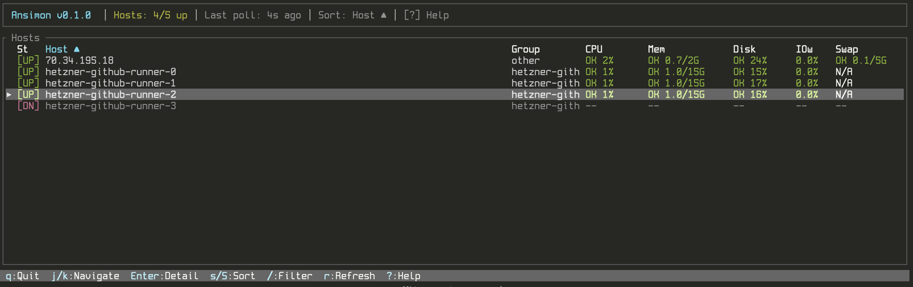

# 🖥️ Ansimon

A TUI monitor compatible with Ansible inventories. Connects to hosts via SSH in an agentless fashion and displays live system metrics in a scrollable, sortable table.




## ✨ Features

- 📋 **Ansible inventory compatible** — reads INI and YAML inventory files
- 🔐 **Agentless** — uses SSH, no agent installation required
- 📊 **Live metrics** — CPU, memory, disk, IO wait, swap (updated every poll cycle)
- 🔍 **Detail panel** — press `Enter` to see extended metrics: load, network I/O, TCP connections, processes, disk I/O, uptime, SSH latency
- 🔎 **Filter & sort** — filter hosts by name/group, sort by any column
- 🎯 **`--limit` support** — same pattern syntax as Ansible (`--limit webservers`, `--limit '*.prod'`, `--limit '!db*'`)
- ⚡ **Concurrent** — parallel SSH connections with configurable forks
- 🚫 **No root required** — all remote commands read from `/proc` and use standard utilities

## 📦 Installation

```bash
cargo build --release
cp target/release/ansimon /usr/local/bin/
```

## 🚀 Usage

```bash
# Basic usage with an inventory file
ansimon -i /path/to/inventory

# Limit to specific hosts or groups
ansimon -i inventory.yml --limit webservers
ansimon -i inventory.yml --limit 'web*.prod'
ansimon -i inventory.yml --limit '!databases'

# Specify SSH user and key
ansimon -i inventory.yml -u deploy -k ~/.ssh/deploy_key

# Custom poll interval (seconds) and concurrency
ansimon -i inventory.yml --interval 30 --forks 20

# Specify SSH port
ansimon -i inventory.yml -p 2222
```

### Options

| Flag | Description |
|------|-------------|
| `-i, --inventory` | Path to Ansible inventory file (INI or YAML) |
| `-l, --limit` | Limit to subset of hosts (glob patterns, groups, `!` exclusion) |
| `-u, --user` | SSH user (overrides inventory `ansible_user`) |
| `-k, --key` | Path to SSH private key |
| `-p, --port` | SSH port (overrides inventory `ansible_port`) |
| `-f, --forks` | Maximum concurrent SSH connections (default: 10) |
| `--interval` | Poll interval in seconds (default: 10) |

## ⌨️ Keyboard Shortcuts

| Key | Action |
|-----|--------|
| `q` / `Ctrl-C` | Quit |
| `j` / `k` / `↑` / `↓` | Navigate up/down |
| `g` / `G` | Go to first/last host |
| `Ctrl-D` / `Ctrl-U` | Page down/up |
| `Enter` | Toggle detail panel |
| `s` / `S` | Cycle sort column / Reverse sort |
| `/` | Filter hosts by name or group |
| `r` | Force refresh all hosts |
| `?` | Toggle help overlay |

## 📊 Table Columns

| Column | Description |
|--------|-------------|
| **St** | Host status: `[UP]` `[DN]` `[..]` `[--]` |
| **Host** | Hostname from inventory |
| **Group** | First Ansible group |
| **CPU** | CPU usage % (1s sample delta) |
| **Mem** | Memory used/total in GB |
| **Disk** | Root filesystem usage % |
| **IOw** | IO wait % |
| **Swap** | Swap used/total in GB (`N/A` if no swap configured) |

Press `Enter` to open the detail panel with extended metrics: load averages, network I/O, TCP connections, running processes, disk I/O throughput, CPU count, uptime, and SSH latency.

## 🔒 Security

### No Root Required

All remote commands run as a normal unprivileged user. Ansimon reads from:

| Source | Permission | What it provides |
|--------|-----------|------------------|
| `/proc/stat` | world-readable | CPU usage, IO wait |
| `/proc/meminfo` | world-readable | Memory, swap |
| `/proc/loadavg` | world-readable | Load averages, process counts |
| `/proc/uptime` | world-readable | System uptime |
| `/proc/net/dev` | world-readable | Network interface counters |
| `/proc/net/sockstat` | world-readable | TCP connection count |
| `/proc/diskstats` | world-readable | Disk I/O counters |
| `df -P /` | no privileges needed | Disk usage |
| `nproc` | no privileges needed | CPU count |

### Dedicated SSH User (Recommended)

For production environments, create a dedicated `ansimon` user on each monitored host with minimal permissions:

```bash
# On each monitored host
sudo useradd -r -s /bin/bash -m ansimon
sudo mkdir -p /home/ansimon/.ssh
sudo chmod 700 /home/ansimon/.ssh

# Copy your public key
sudo cp /path/to/ansimon_key.pub /home/ansimon/.ssh/authorized_keys
sudo chmod 600 /home/ansimon/.ssh/authorized_keys
sudo chown -R ansimon:ansimon /home/ansimon/.ssh
```

Then run ansimon with:

```bash
ansimon -i inventory.yml -u ansimon -k ~/.ssh/ansimon_key
```

### SSH Command Restriction (Optional)

For maximum lockdown, restrict what the `ansimon` user can execute over SSH using `rbash` (restricted bash) with a controlled `PATH`. This is built into every Linux system — no custom scripts or extra software needed.

```bash
# 1. Set the user's shell to rbash
sudo usermod -s /bin/rbash ansimon

# 2. Create a restricted bin directory with only the allowed commands
sudo mkdir -p /home/ansimon/bin
for cmd in cat head tail echo sleep df nproc; do
    sudo ln -s "$(which $cmd)" /home/ansimon/bin/$cmd
done

# 3. Lock the PATH in .bash_profile (must be owned by root so the user can't edit it)
echo 'export PATH=/home/ansimon/bin' | sudo tee /home/ansimon/.bash_profile > /dev/null
sudo chown root:root /home/ansimon/.bash_profile
sudo chmod 644 /home/ansimon/.bash_profile
```

`rbash` prevents the user from:
- Changing `PATH`
- Using `/` in command names (e.g. `/bin/rm`)
- Redirecting output with `>` or `>>`
- Using `cd`

Combined with the SSH key options in `authorized_keys`:

```
no-port-forwarding,no-X11-forwarding,no-agent-forwarding ssh-ed25519 AAAA... ansimon@monitor
```

This allows `cat`, `df`, `head`, `tail`, `echo`, `sleep`, and `nproc` with any arguments, but nothing else — even if the private key is compromised.

## 📁 Inventory Format

Ansimon supports standard Ansible inventory formats:

### INI Format

```ini
[webservers]
web01 ansible_host=192.168.1.10
web02 ansible_host=192.168.1.11

[databases]
db01 ansible_host=192.168.1.20 ansible_port=2222
db02 ansible_host=192.168.1.21 ansible_user=dbadmin

[webservers:vars]
ansible_user=deploy
```

### YAML Format

```yaml
all:
  children:
    webservers:
      hosts:
        web01:
          ansible_host: 192.168.1.10
        web02:
          ansible_host: 192.168.1.11
      vars:
        ansible_user: deploy
    databases:
      hosts:
        db01:
          ansible_host: 192.168.1.20
          ansible_port: 2222
```

## 🛠️ Building from Source

```bash
git clone https://github.com/yourusername/ansimon.git
cd ansimon
cargo build --release
```

### Requirements

- Rust 1.70+
- SSH client (`ssh` command available in PATH)
- Linux target hosts (reads from `/proc`)

## 📄 License

MIT
